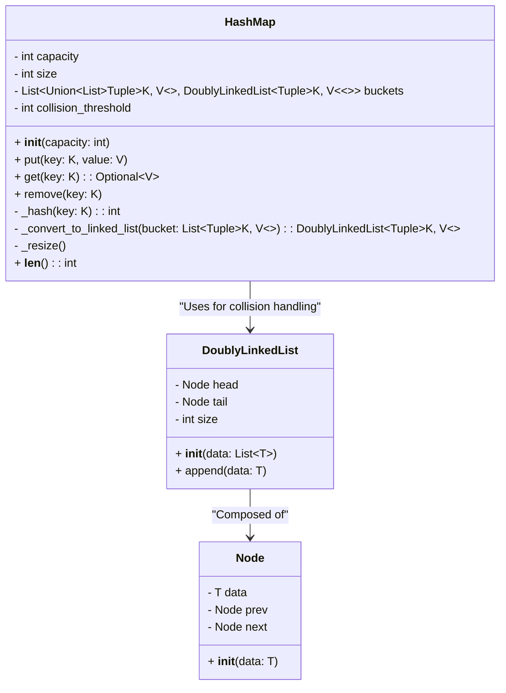
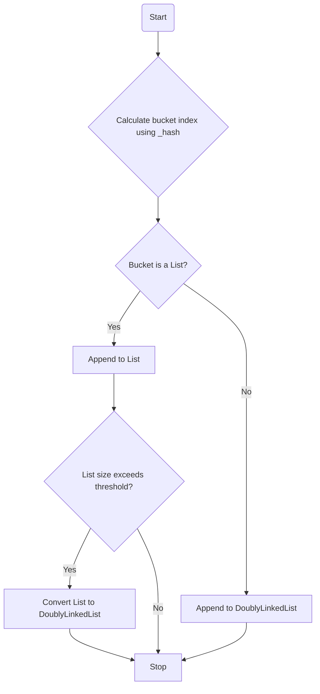
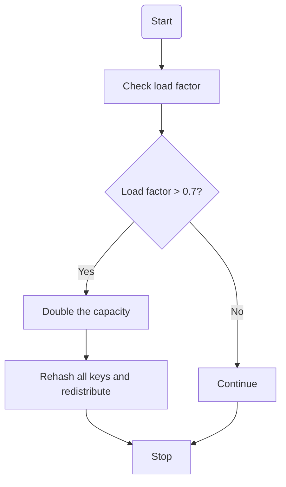

# Hash Map

This `HashMap` implementation uses a **hybrid approach** for optimal performance. This design combines Python lists and doubly linked lists to handle collisions efficiently.

### Hybrid HashMap Design

This _hybrid_ implementation:
- Starts with lists for buckets to minimize memory overhead.
- Converts buckets to doubly linked lists when collisions exceed a predefined threshold.
- Dynamically resizes the buckets array when the load factor exceeds 0.7, ensuring consistent performance.

### Key Components

1. **Buckets:**
- Stored as an array of `capacity` size.
- Each bucket can either be:
- A simple Python list (default).
- A `DoublyLinkedList` when collisions exceed a predefined threshold.

2. **Hash Function:**
- Uses Python's built-in `hash` function modulo `capacity` to compute the bucket index.
- Ensures even distribution of keys to minimize collisions.

3. **Dynamic Resizing:**
- When the load factor (number of elements/capacity) exceeds 0.7, the buckets array is resized to double its current capacity.
- All existing key-value pairs are rehashed and redistributed into the new buckets.

4. **Collision Handling:**
- Starts with a simple list for handling collisions.
- Converts to a `DoublyLinkedList` when the number of elements in a bucket exceeds `collision_threshold`.

5. **Hybrid Structure Advantages:**
- Lists provide fast appends for low-collision scenarios.
- `DoublyLinkedList` ensures efficient insertion and deletion for high-collision scenarios.

### High-Level UML Diagram

Below is the high-level UML diagram for the `HashMap`:

### Collision Handling Flow

The diagram below explains the process of handling collisions in a hash-based data structure, such as a hash map or hash table. Collisions occur when multiple keys are hashed to the same bucket index. Here's the step-by-step explanation:

1. **Calculate Bucket Index**:
   The bucket index is computed using the `_hash(key)` function, which determines the position of the key-value pair in the data structure.

2. **Check if the Bucket Contains a List**:
   If the bucket already holds a list (indicating previous collisions), proceed to append the new key-value pair to the list.

3. **Check List Size Threshold**:
   If the size of the list exceeds a pre-defined threshold (e.g., a maximum list size), convert the list into a `DoublyLinkedList`. This conversion improves the efficiency of collision handling by reducing the search time for keys.

4. **If Not a List**:
   If the bucket does not already contain a list, initialize a `DoublyLinkedList` and append the key-value pair.

This process ensures efficient management of collisions while keeping operations like insertion and retrieval optimized.

### Resizing Workflow

The diagram below outlines the workflow for resizing a hash-based data structure when the load factor exceeds a certain threshold. The load factor is the ratio of the number of elements (size) to the total capacity (buckets) of the data structure. Here's the explanation:

1. **Check Load Factor**:
   Calculate the load factor using the formula `size / capacity`. If the load factor exceeds a pre-defined threshold (commonly 0.7), resizing is triggered.

2. **Double the Capacity**:
   The capacity of the data structure is doubled to reduce the load factor, ensuring efficient operations.

3. **Rehash and Redistribute Keys**:
   All keys in the data structure are rehashed to recalculate their bucket indices based on the new capacity. This step redistributes the key-value pairs to the appropriate buckets, preventing clustering and improving lookup times.

4. **If Load Factor Is Within Limits**:
   If the load factor is below or equal to the threshold, no resizing is required, and the data structure continues to operate normally.

This workflow ensures that the hash-based data structure remains efficient even as the number of elements grows.

### How the Hybrid Approach Achieves Optimal Performance

This hybrid design highlights the importance of adapting to workload patterns in real-world scenarios. The use of a hybrid approach allows the `HashMap` to optimize both time complexity and memory management, making it a robust implementation for dynamic datasets.

#### 1. **Efficient Collision Handling**
- **Low Collision Scenario:** Buckets remain as simple Python lists.
- Fast appends (`O(1)` average) for low-collision cases.
- **High Collision Scenario:** Buckets convert to `DoublyLinkedList`.
- Insertions and deletions are efficient (`O(1)` average), even for large bucket sizes.
- This hybrid approach balances simplicity and efficiency depending on the level of collisions.

#### 2. **Dynamic Resizing**
- The resizing mechanism ensures the load factor remains below the threshold (0.7).
- Prevents buckets from growing too large, maintaining average-case `O(1)` performance for `put`, `get`, and `remove`.

#### 3. **Memory Utilization**
- Lists are memory-efficient for sparse buckets.
- `DoublyLinkedList` avoids the overhead of resizing lists during high collision scenarios, reducing overall memory fragmentation.

#### 4. **Improved Search and Maintenance**
- Lists provide simple and fast linear searches when the bucket size is small.
- `DoublyLinkedList` allows efficient deletion and restructuring of data when bucket size grows due to collisions.

#### 5. **Flexibility in Key Management**
- Switching between list and `DoublyLinkedList` dynamically adapts to varying workloads, ensuring consistent performance.
